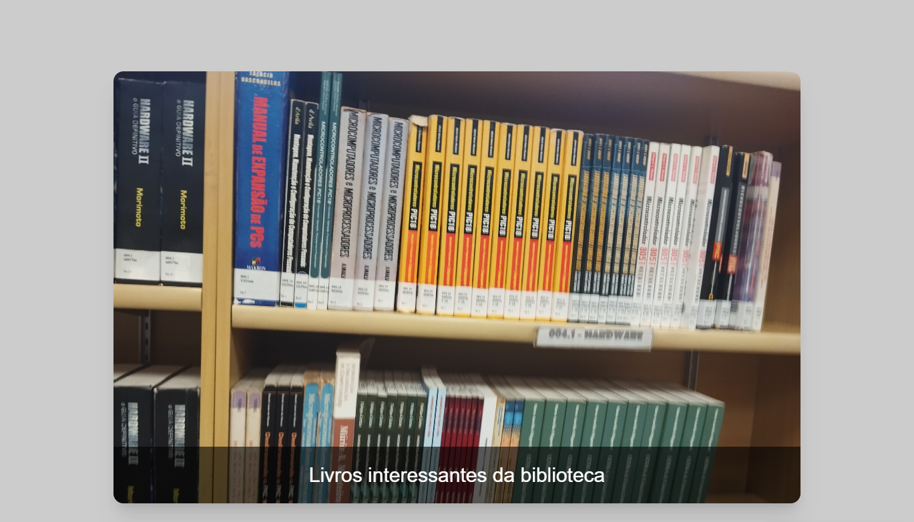

# Slide

## Sobre
Projeto desenvolvido na retomada do segundo semestre do curso técnico do SENAI, cujo objetivo era transformar uma página previamente desenvolvida pelo professor Fernando Leonid utilizando o framework Tailwind CSS.

(

## Tecnologias utilizadas
- HTML
- Tailwind CSS
- keyframes

## Autor
- [Breno Oliveira](https://www.linkedin.com/in/breno-oliveira-assis-reis-203010351/).

